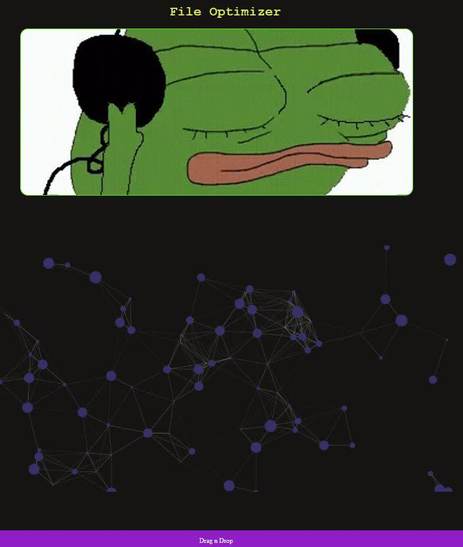

# Image Optimizer



## Usage
Just drag and drop media file on `dancing pepe` and wait for conversion.
Alternatively you can click `dancing pepe` and select file from dialog.

## Requirements
* Python3
* ffmpeg

#### Ubuntu
```shell
apt-get install ffmpeg
```

#### OpenSUSE
```sh
zypper install ffmpeg
```

### Alpine
```sh
apk add ffmpeg
```
### CentOS
```sh
yum install ffmpeg
```

## Fedora
```sh
dnf install ffmpeg
```

## Starting App
```sh
python3 main.py
```


## Configuration 
The web app can be configured using `config.yaml` located in it's root.
Default configuration is like this. 
```yaml
port : 8080
ip : localhost
app_root: /
debug: False
```
By default this app listens on `localhost`. To listen on all interfaces use `0.0.0.0` in IP.
The default listening protocol is `http`.

`app_root` is the route to main page. This is especially handy if multiple web applications are running on port 80.

## How does it work?
This uses `ffmpeg` to optimize image/video quality.

## nginx Conf 
* Put the contents of `static` in your nginx static root.
* If you already have an app running on port 80, set `app_root` to something like `/image=optimizer`.

## What's `uploads` folder?
Optimized images will go into `uploads` folder. Write scedulers/watchdogs to frequently clear the contents of uploads.

## Can I put `src` in static root?
No, these files are html/js/css templates. They won't be rendered properly by browsers. 

## Wanna ****ing grow up and use `npm`?
I already am using npm. These are readable code builds. ising npm.

